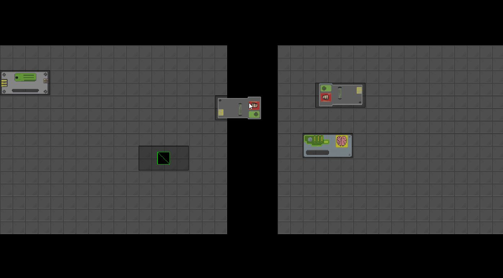

# gridInventory

**RU**
`gridInventory` — грид-инвентарь для игр на **Phaser 3** (TypeScript). Тетрис-ячейки, drag-&-drop, поворот, проверка коллизий и JSON-сохранение. Ядро написано без привязки к рендеру; UI-пример — на **rexUI**.

**Что умеет**

* Сетка `rows × cols`, настраиваемый размер ячейки.
* Размещение предметов произвольного `w×h` с проверкой границ и пересечений.
* Повороты (`0/90/180/270`), подсветка валидных/невалидных позиций.
* Drag-&-drop между слотами/контейнерами.
* Снимок состояния: `toJSON()` / `fromJSON()`.

**Как использовать (идея)**

* Берёте **core** (логика) — подключаете в свой проект.
* Хотите быстрый старт — запускаете демо-сцену на Phaser + rexUI.
* Дальше расширяете под себя: фильтры слотов, веса/объём, стаки.

**Кому подойдёт**
Инди-разработчикам на Phaser 3, кто хочет «тетрис-инвентарь» без переписывания базы.

**План**
стэки • несколько контейнеров • ограничения веса/объёма • undo/redo • тесты

Теги: `phaser3`, `typescript`, `inventory`, `grid`, `rexui`, `game-dev`.

---

**EN**
`gridInventory` is a grid-based inventory for **Phaser 3** (TypeScript): tetris-style slots, drag-&-drop, rotation, collision checks, and JSON snapshots. Core logic is renderer-agnostic; a small **rexUI** demo is included.

**Features**

* Configurable `rows × cols` grid and cell size.
* Place items of arbitrary `w×h` with bounds & overlap checks.
* Rotations (`0/90/180/270`) with valid/invalid placement hints.
* Drag-&-drop across slots/containers.
* State snapshots: `toJSON()` / `fromJSON()`.

**Usage (idea)**

* Use the **core** package for pure logic.
* Spin up the Phaser + rexUI demo for a quick start.
* Extend as needed: slot filters, weight/volume limits, stacks.

**Who is it for**
Phaser 3 indie devs who want a tetris-inventory without rebuilding fundamentals.

**Roadmap**
stacks • multi-containers • weight/volume • undo/redo • tests

Tags: `phaser3`, `typescript`, `inventory`, `grid`, `rexui`, `game-dev`.
